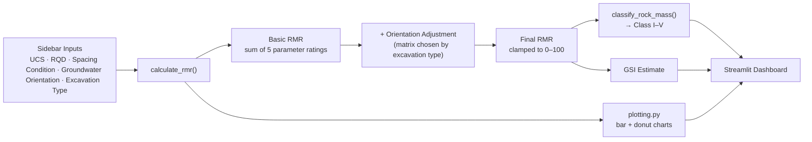

# RMR89 Calculator - Rock Mass Rating Toolkit

*Instant, standards-based rock mass classification - from field observations to engineering parameters.*

[](https://www.python.org/)
[](https://streamlit.io/)
[](https://docs.pytest.org/)

> **⚠️ Engineering disclaimer:** This tool produces *preliminary, empirical* estimates only. It is not a substitute for a site-specific geotechnical investigation or the sign-off of a qualified, licensed geotechnical/geological engineer. Do not use its output as a final basis for excavation support design. See [Limitations & Disclaimer](#limitations--disclaimer).

---


## Overview

This is a geotechnical engineering application that answers a fundamental rock mechanics question: ***"How strong is the rock mass?"***

It automates the **Bieniawski (1989) Rock Mass Rating (RMR89)** classification system, turning raw field/borehole observations into a standardized 0-100 point score, an engineering rock class (I-V), and a set of derived design parameters - Mohr-Coulomb strength envelope, stand-up time, and an estimated Geological Strength Index (GSI). It's built as a self-contained Streamlit dashboard, intended to sit alongside larger slope-stability and underground-excavation toolkits.

## Key Features

- **Interactive input engine** - Real-time scoring as you adjust UCS, RQD, discontinuity spacing, joint condition, and groundwater condition. There's no "submit" button; every widget change triggers an instant recalculation.
- **Context-aware orientation penalties** - Discontinuity orientation penalties are pulled from one of **three different penalty matrices** (Tunnels & Mines / Slopes / Foundations), reflecting the different kinematic failure risks of each excavation type. The orientation dropdown itself updates dynamically based on the selected excavation type.
- **Dynamic visualizations:**
  - A horizontal bar chart showing each parameter's actual score against its maximum possible score.
  - A donut chart isolating exactly which parameters are *penalizing* the rock mass most (the "lost points" view).
- **Automated design estimations** - Instant translation of the final RMR into a typical stand-up time window, an internal friction angle range (φ′), a cohesion range (c′), and general support guidelines.
- **Graceful error handling** - Invalid input (e.g. RQD out of its valid 0–100% domain, or an unrecognized condition/groundwater/orientation value) is caught and surfaced as an inline error banner rather than crashing the app or silently miscalculating.
- **Strict, literature-faithful rating logic** - Every rating uses the exact discrete step boundaries published in the 1989 standard, rather than smoothing values via linear interpolation between bands.

## How It Works

The diagram below traces a single calculation from sidebar input to rendered dashboard:



The five core parameters and the orientation adjustment are each scored independently using strict, non-interpolated thresholds straight from the source tables, then summed. Here is exactly how each one is scored:

### 1. Intact Rock Strength (UCS)

| UCS (MPa)     | Rating |
|---------------|:------:|
| > 250         | 15     |
| 100 – 250     | 12     |
| 50 – 100      | 7      |
| 25 – 50       | 4      |
| 5 – 25        | 2      |
| 1 – 5         | 1      |
| < 1           | 0      |

### 2. Drill Core Quality (RQD)

| RQD (%)   | Rating |
|-----------|:------:|
| ≥ 90      | 20     |
| 75 – 90   | 17     |
| 50 – 75   | 13     |
| 25 – 50   | 8      |
| < 25      | 3      |

Input is validated against its physical domain - a value outside **0-100%** raises a `ValueError`, which the app surfaces as an on-screen error rather than producing a nonsensical rating.

### 3. Spacing of Discontinuities

| Spacing (m)   | Rating |
|---------------|:------:|
| > 2.0         | 20     |
| 0.6 – 2.0     | 15     |
| 0.2 – 0.6     | 10     |
| 0.06 – 0.2    | 8      |
| < 0.06        | 5      |

### 4. Condition of Discontinuities

| Description                                                                  | Rating |
|-------------------------------------------------------------------------------|:------:|
| Very rough surfaces, not continuous, no separation, unweathered wall rock     | 30     |
| Slightly rough surfaces, separation < 1 mm, slightly weathered walls         | 25     |
| Slightly rough surfaces, separation < 1 mm, highly weathered walls           | 20     |
| Slickensided surfaces, OR gouge < 5 mm thick, OR separation 1–5 mm, continuous | 10   |
| Soft gouge > 5 mm thick, OR separation > 5 mm, continuous                     | 0      |

### 5. Groundwater Condition

| Condition        | Rating |
|-------------------|:------:|
| Completely dry    | 15     |
| Damp               | 10     |
| Wet                | 7      |
| Dripping           | 4      |
| Flowing            | 0      |

### 6. Basic RMR

```
Basic RMR = UCS rating + RQD rating + Spacing rating + Condition rating + Groundwater rating
```

This is the sum of the five tables above, theoretically capped at 100 (15 + 20 + 20 + 30 + 15).

### 7. Discontinuity Orientation Adjustment

Unlike the five parameters above, the orientation penalty is **negative** and depends on the chosen excavation context. The app exposes three separate matrices, selected automatically based on the "Excavation Type" dropdown:

| Orientation        | Tunnels & Mines | Slopes | Foundations |
|---------------------|:---------------:|:------:|:-----------:|
| Very favorable      | 0                | 0      | 0            |
| Favorable           | −2               | −5     | −2           |
| Fair                | −5               | −25    | −7           |
| Unfavorable         | −10              | −50    | −15          |
| Very unfavorable    | −12              | −60    | −25          |

Notice how much harsher the **Slopes** matrix is - a poorly oriented discontinuity is far more likely to trigger a kinematic slope failure (planar/wedge sliding) than to compromise a tunnel, so the penalty curve is steeper.

### 8. Final RMR

```
Final RMR = Basic RMR + Orientation Adjustment, clamped to the range [0, 100]
```

### 9. Rock Mass Classification

The Final RMR maps to one of five Bieniawski engineering classes:

| Class | RMR Range | Description     | Stand-up Time              | Cohesion *c′* (kPa) | Friction Angle *φ′* |
|:-----:|:---------:|------------------|-----------------------------|:--------------------:|:---------------------:|
| I     | 81 – 100  | Very Good Rock   | 20 years for a 15 m span    | > 400 *(shown as 400–1000)* | > 45° *(shown as 45–60°)* |
| II    | 61 – 80   | Good Rock        | 1 year for a 10 m span      | 300 – 400             | 35 – 45°              |
| III   | 41 – 60   | Fair Rock        | 1 week for a 5 m span       | 200 – 300             | 25 – 35°              |
| IV    | 21 – 40   | Poor Rock        | 10 hours for a 2.5 m span   | 100 – 200             | 15 – 25°              |
| V     | 0 – 20    | Very Poor Rock   | 30 minutes for a 1 m span   | < 100 *(shown as 0–100)*   | < 15° *(shown as 0–15°)* |

Each class also carries a general support guideline, shown in the dashboard's "Support Recommendations" panel:

- **Class I:** Generally no support required except for occasional spot bolting.
- **Class II:** Locally, rock bolts in the crown, 3 m long, spaced 2.5 m, with occasional wire mesh.
- **Class III:** Systematic bolts 4 m long, spaced 1.5–2 m in crown and walls, with wire mesh; 50–100 mm shotcrete in the crown.
- **Class IV:** Systematic bolts 4–5 m long, spaced 1–1.5 m; 100–150 mm shotcrete in the crown, 100 mm on the walls; light steel sets.
- **Class V:** Systematic bolts 5–6 m long, spaced 1–1.5 m; 150–200 mm shotcrete; medium/heavy steel sets spaced 0.75 m.

### 10. Geological Strength Index (GSI) Estimate

The app cross-references the Final RMR against the **Hoek et al. (1995)** empirical offset:

```
GSI ≈ Final RMR − 5      (only valid/applied when Final RMR > 23)
```

For Final RMR values of 23 or below, where that linear offset starts producing unreliable or non-physical results, the app falls back to simply reporting **GSI ≈ Final RMR** itself, rather than subtracting 5. In other words, the −5 offset is only applied in the upper rating range; below the cutoff, GSI tracks RMR one-to-one as a conservative approximation.

## Getting Started

### Prerequisites

- Python 3.8 or newer
- `pip`

### Installation

```bash
pip install -r requirements.txt
```

Core dependencies are [Streamlit](https://streamlit.io/) (UI), [Matplotlib](https://matplotlib.org/) and [NumPy](https://numpy.org/) (charts), and [pytest](https://docs.pytest.org/) (tests).

### Usage

```bash
streamlit run app.py
```

This opens the dashboard in your browser (by default at `http://localhost:8501`). From there:

1. Enter your field/lab measurements in the sidebar - UCS, RQD, discontinuity spacing, joint condition, and groundwater condition.
2. Choose an **Excavation Type** (Tunnels & Mines, Slopes, or Foundations) and a matching **Discontinuity Orientation** - the orientation options refresh automatically to match whichever excavation type you've selected.
3. The four headline metrics update instantly: **Final RMR** (with the pre-orientation Basic RMR shown as a delta), **Rock Class**, **Rock Quality** description, and **Estimated GSI**.
4. Scroll down for the parameter-contribution bar chart, the quality-degradation donut chart, and the engineering interpretation panel (Mohr-Coulomb cohesion/friction range, stand-up time, and support recommendations).


## Tech Stack

| Layer            | Tool                                   |
|-------------------|-----------------------------------------|
| UI / dashboard    | [Streamlit](https://streamlit.io/)     |
| Charting          | [Matplotlib](https://matplotlib.org/) + [NumPy](https://numpy.org/) |
| Data modeling     | Python `dataclasses` (stdlib)          |
| Testing           | [pytest](https://docs.pytest.org/)     |
| Language          | Python 3                                |

## Limitations & Disclaimer

- This is an **empirical, preliminary estimation tool**. It implements the Bieniawski (1989) RMR system but does not replace a proper site investigation, core logging, or the judgment of a qualified geotechnical/geological engineer.
- Ratings intentionally use **discrete, non-interpolated step boundaries**, per the original 1989 publication. This means two measurements just on either side of a boundary (e.g. UCS of 99.9 MPa vs. 100.1 MPa) can fall into different rating bands - this is a known characteristic of RMR89 itself, not a defect in this implementation.
- The **GSI estimate** is a simplified linear offset intended as a rough cross-reference, not a substitute for a proper Geological Strength Index assessment from outcrop or core photographs against the published GSI chart.
- The **orientation adjustment** uses simplified categorical penalty matrices, not a full kinematic analysis (e.g. stereonet/wedge-failure analysis of joint sets against excavation geometry).
- **Support guidelines** reflect Bieniawski's general, original recommendations. They are a starting reference point only and must be reviewed by a qualified engineer against local codes and site-specific conditions before being used in any support design.


## References

- Bieniawski, Z. T. (1989). *Engineering Rock Mass Classifications*. New York: Wiley.
- Hoek, E., Kaiser, P. K., & Bawden, W. F. (1995). *Support of Underground Excavations in Hard Rock*. Rotterdam: Balkema.

## Author

**Aayush Kumar Lal** — [LinkedIn](https://www.linkedin.com/in/aayush-kumar-lal-4ba438322/) | [GitHub](https://github.com/aayushkumarlal50-dev)